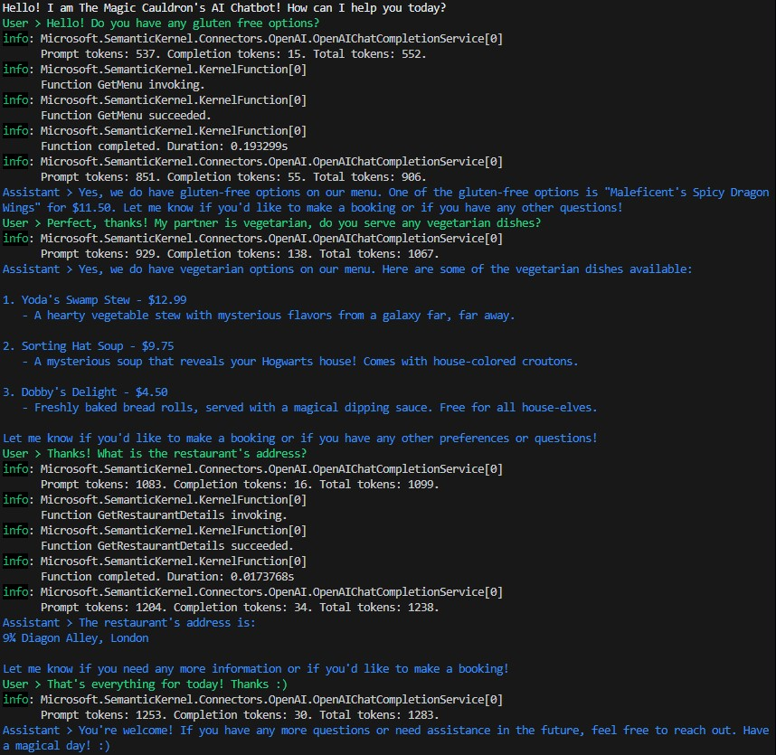
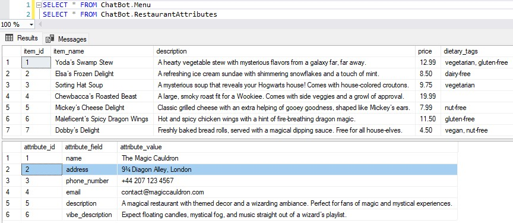
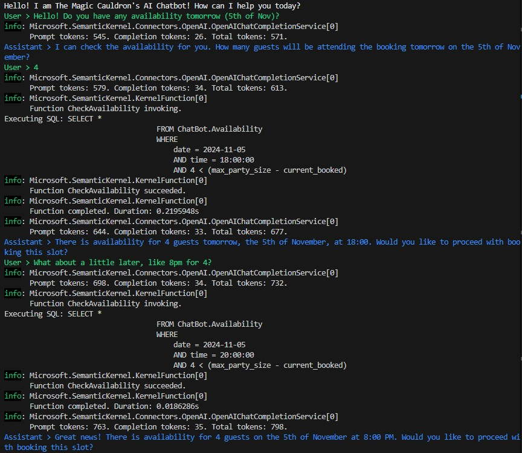
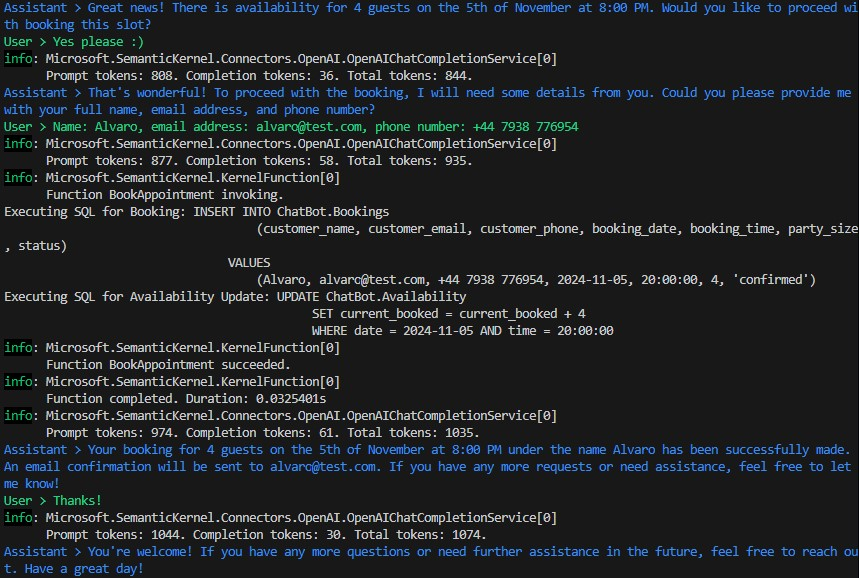
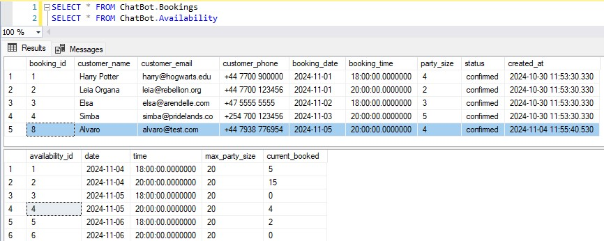

# The Magic Cauldron AI Chatbot

Welcome to **The Magic Cauldron AI Chatbot**, an interactive console-based assistant for handling restaurant bookings, cancellations, FAQs, and feedback at The Magic Cauldron. This AI-powered application leverages Microsoft Semantic Kernel, OpenAI, and .NET 8.0 to offer seamless interactions, making restaurant management more efficient and user-friendly.

## Project Overview
This application uses Microsoft Semantic Kernel and OpenAI to power an AI chatbot for customer service. The chatbot assists customers by handling bookings, responding to frequently asked questions, and collecting feedback.

## Prerequisites
1. .NET 8.0 SDK
2. OpenAI API key (sign up at OpenAI)
3. .env file configured with the following environment variables:
    - `OPENAI_MODEL_ID` (e.g., text-davinci-002, gpt-3.5-turbo, etc.)
    - `OPENAI_API_KEY`

## Getting Started
1. Clone the repository and navigate to the project directory.

2. Create a .env file in the root directory of the project. Add the following environment variables:
    - `OPENAI_MODEL_ID=your_openai_model_id`
    - `OPENAI_API_KEY=your_openai_api_key`
3. Build and Run the application:

```
dotnet build
dotnet run
```

## Dependencies

The application uses the following NuGet packages, managed in the .csproj file:
1. DotNetEnv (v3.1.1): For loading environment variables from the .env file.
2. Microsoft.Extensions.Configuration.Json (v8.0.1): For managing JSON-based configuration.
3. Microsoft.Extensions.Logging and Microsoft.Extensions.Logging.Console (v8.0.1): For logging output to the console.
4. Microsoft.SemanticKernel (v1.25.0): Core library for building and running semantic applications.
5. System.Data.SqlClient (v4.8.6): For potential future extensions involving database connectivity.

## Usage
Upon starting, the chatbot will greet you and prompt for your input. The bot can handle the following interactions:

1. **Bookings**: Make or cancel a reservation by providing necessary details (e.g., date, time, number of guests).
2. **FAQs**: Get answers to common questions about The Magic Cauldron (e.g., hours, menu items).
3. **Feedback**: Submit customer feedback to improve restaurant service.
4. **General Assistance**: Engage in conversation for other inquiries.

## Project Structure
- **Program.cs**: The main entry point containing the chatbot logic and conversation handling.
- **Plugins**: Contains BookingsPlugin and RestaurantInfoPlugin for specialized functionalities like handling bookings and providing restaurant information.

## Key Libraries and Services
- **Microsoft.SemanticKernel**: Enables natural language processing and semantic understanding.
- **Microsoft.SemanticKernel.Connectors.OpenAI**: Provides OpenAI integration for natural conversational responses.
- **DotNetEnv**: Manages environment variables to ensure sensitive information remains secure.
- **System.Data.SqlClient**: Included for potential future integration with a SQL database for storing bookings and feedback.

## The Code in Action







## License
This project is open-source. You are free to modify it for personal or commercial use.